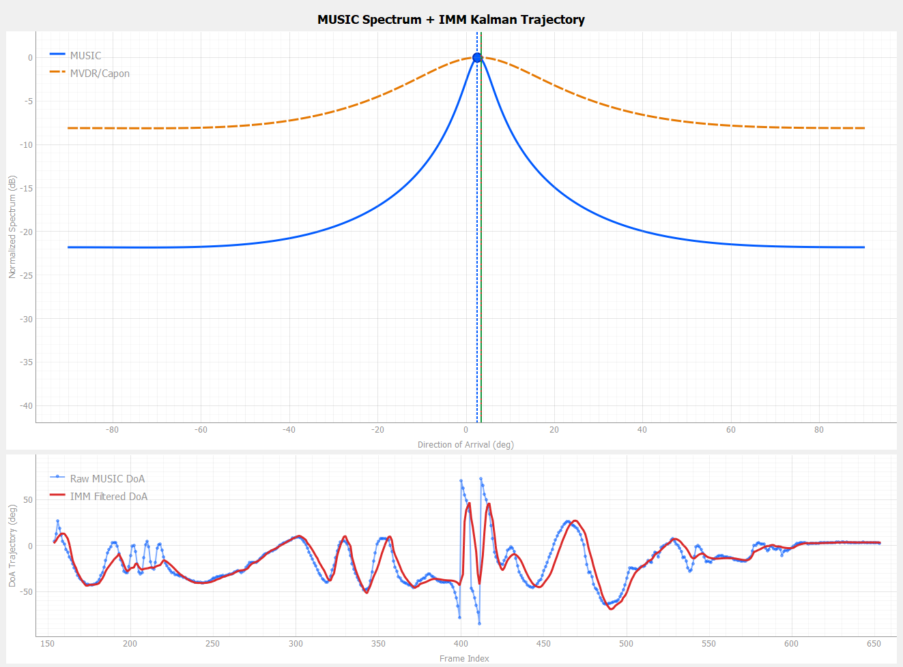
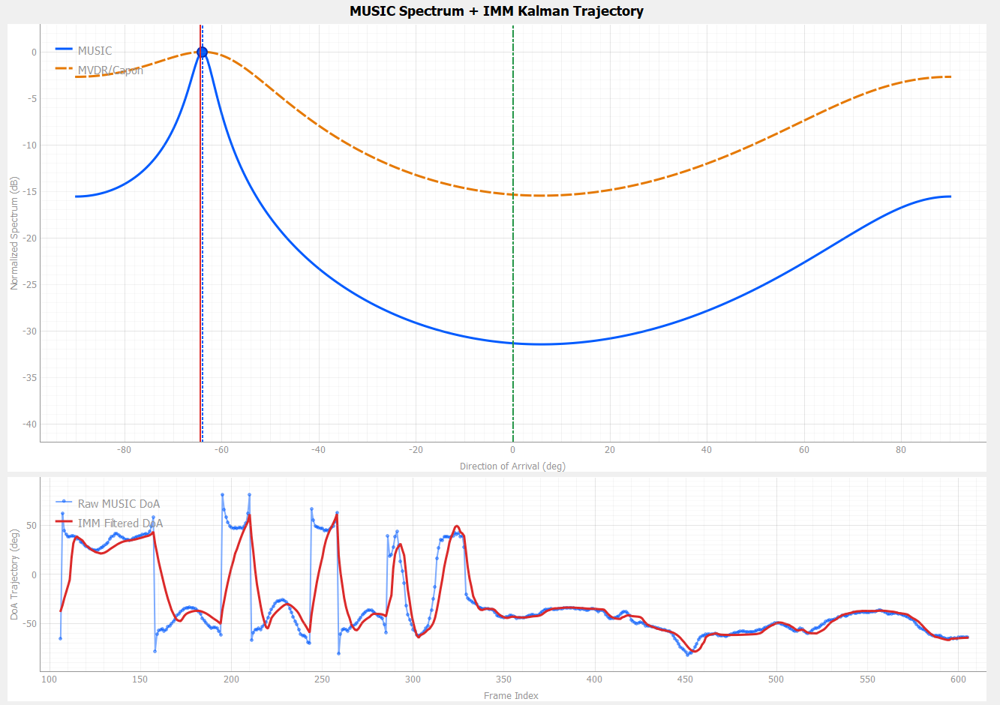
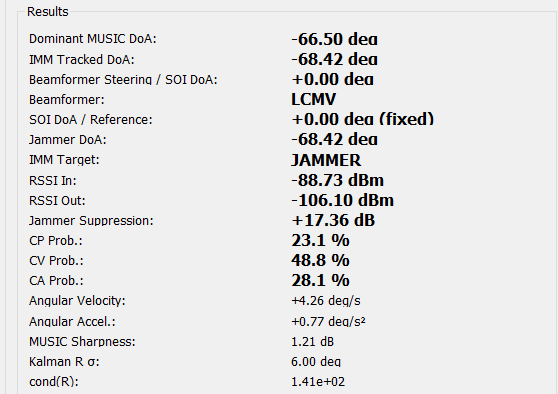

# EE4084 Kalman and Bayesian Filters Project

## Dynamic DoA Tracking and Jammer Suppression Using MUSIC, IMM Kalman Filtering, MVDR and LCMV Beamforming

This repository contains the source code, presentation material, and experimental result images for the **EE4084 Kalman and Bayesian Filters** course project.

The project demonstrates a real-time **direction of arrival (DoA) tracking** and **jammer suppression** system using an **ADALM-Pluto SDR / AD936x** based setup. The receiver estimates the dominant signal direction with the MUSIC algorithm, tracks the angle using an Interacting Multiple Model (IMM) Kalman filter, and switches the beamforming strategy according to the jammer state.

## Project Motivation

In many wireless, radar, and electronic warfare scenarios, the desired signal is not always the strongest signal at the receiver. A jammer can dominate the received signal and therefore dominate the spatial covariance matrix used for DoA estimation.

Since this project uses a two-channel receiver, the system can reliably estimate one dominant DoA at a time. Therefore, the physical meaning of the MUSIC peak depends on the operating condition:

- **No-jammer mode:** the dominant MUSIC peak is interpreted as the signal of interest (SOI).
- **Jammer-present mode:** the jammer is stronger than the SOI, so the dominant MUSIC peak is interpreted as the jammer.

This mode-dependent interpretation allows the same MUSIC and IMM Kalman tracking chain to support both normal SOI tracking and jammer tracking.

## System Overview

The implemented real-time processing chain is:

1. Transmit QPSK SOI from **Tx0**.
2. Optionally transmit a stronger CW jammer from **Tx1**.
3. Receive two-channel IQ data using **RX0** and **RX1**.
4. Apply fixed inter-channel phase calibration.
5. Estimate the spatial covariance matrix.
6. Compute the MUSIC spectrum and detect the dominant DoA.
7. Use the MUSIC DoA as the scalar measurement of the IMM Kalman filter.
8. Select the operating mode:
   - Tx1 OFF → SOI tracking + MVDR beamforming
   - Tx1 ON → jammer tracking + LCMV beamforming
9. Display live DoA, filtered trajectory, beamformer state, RSSI values, suppression, and IMM model probabilities in the GUI.

## Kalman Filter Process Model

The Kalman filter tracks angular motion rather than Cartesian position. The state vector is:

```math
x_k = \begin{bmatrix}
\theta_k \\
\dot{\theta}_k \\
\ddot{\theta}_k
\end{bmatrix}
```

where:

- `theta` is the DoA angle,
- `theta_dot` is the angular velocity,
- `theta_ddot` is the angular acceleration.

The process model is:

```math
x_k = F x_{k-1} + w_k
```

where `F` is the state transition matrix and `w_k` is the process noise.

The IMM filter uses three angular motion models:

- **CP (Constant Position):** suitable for nearly stationary angular sources.
- **CV (Constant Velocity):** suitable for smooth angular motion.
- **CA (Constant Acceleration):** suitable for accelerated or maneuvering angular motion.

For example, the constant acceleration transition model is:

```math
F_{CA} = \begin{bmatrix}
1 & \Delta t & 0.5\Delta t^2 \\
0 & 1 & \Delta t \\
0 & 0 & 1
\end{bmatrix}
```

## Kalman Filter Measurement Model

The Kalman filter receives one scalar measurement: the MUSIC DoA estimate.

```math
z_k = \hat{\theta}_{MUSIC,k}
```

The measurement equation is:

```math
z_k = Hx_k + v_k
```

with:

```math
H = \begin{bmatrix}1 & 0 & 0\end{bmatrix}
```

Therefore, the filter directly observes only the angle. Angular velocity and angular acceleration are inferred internally from the process model and the sequence of MUSIC angle measurements.

## IMM Kalman Filter Design

The IMM filter runs the CP, CV, and CA Kalman filters in parallel. At each frame:

1. Previous model-conditioned estimates are mixed.
2. Each model performs Kalman prediction and update.
3. The innovation and likelihood of each model are calculated.
4. Bayesian normalization updates the model probabilities.
5. The final state is obtained as a probability-weighted combination of model-conditioned estimates.

The IMM switches between **motion models**, not physical source identities. The physical tracking target is selected by the jammer state:

- Tx1 OFF → IMM tracks SOI DoA.
- Tx1 ON → IMM tracks jammer DoA.

## Beamforming Logic

### MVDR Mode: No Jammer

When Tx1 is disabled, the dominant MUSIC peak is treated as the SOI direction. The IMM-filtered SOI DoA is used as the MVDR steering angle.

The MVDR beamformer minimizes output power while preserving the desired direction.

### LCMV Mode: Jammer Present

When Tx1 is enabled, the stronger jammer becomes the dominant source. The MUSIC peak and IMM-filtered angle are therefore interpreted as the jammer direction.

In this mode:

- SOI direction is assumed fixed at broadside: `0 deg`.
- LCMV keeps unity gain toward the SOI.
- LCMV places a spatial null toward the IMM-tracked jammer DoA.

The suppression metric is calculated as:

```text
Jammer Suppression = RSSI In - RSSI Out
```

This metric is displayed only when the jammer is active and LCMV nulling is applied.

## Experimental Configuration

| Parameter | Value |
|---|---|
| SDR Platform | ADALM-Pluto SDR / AD936x |
| RX Channels | 2 |
| TX Channels | Tx0 SOI, Tx1 jammer |
| Center Frequency | 2.1 GHz |
| Sampling Rate | 5 MS/s |
| RX Antenna Spacing | d = lambda / 2 |
| SOI Modulation | QPSK |
| SOI TX Gain | -20 dB |
| Jammer Type | CW tone |
| Jammer TX Gain | -3 dB |
| Nominal TX Gain Difference | 17 dB |
| SOI Reference in Jammer Mode | 0 deg broadside |
| DoA Scan Range | -90 deg to +90 deg |
| Tracking Filter | IMM Kalman Filter |
| Beamformers | MVDR and LCMV |

## Repository Structure

```text
.
├── README.md
├── src/
│   └── kalman_project.py
├── results/
│   ├── no_jammer_result.png
│   ├── jammer_present_result.png
│   └── jammer_present_meas.png
└── presentation/
    └── EE4084_Dynamic_DoA_Beamforming_Presentation.pptx
```

## Requirements

The project was implemented in Python and requires the following packages:

```bash
pip install numpy pyqt5 pyqtgraph pyadi-iio
```

Hardware/software requirements:

- ADALM-Pluto SDR or compatible AD936x-based SDR setup
- Two RX channels enabled
- Tx0 configured as QPSK SOI transmitter
- Tx1 configured as CW jammer transmitter
- libiio / pyadi-iio environment configured correctly

## Running the GUI

Run the project with:

```bash
python src/kalman_project.py
```

The GUI allows live configuration and visualization of:

- MUSIC spectrum
- raw MUSIC DoA
- IMM-filtered DoA
- active tracking target: SOI or JAMMER
- active beamformer: MVDR or LCMV
- SOI reference direction
- jammer DoA
- RSSI In / RSSI Out
- jammer suppression
- CP, CV, and CA model probabilities

## Results

### No-Jammer Case

In the no-jammer case, Tx1 is disabled. The dominant MUSIC peak corresponds to the SOI direction. The IMM Kalman filter smooths the raw MUSIC DoA trajectory, and MVDR beamforming is used.



### Jammer-Present Case

In the jammer-present case, Tx1 is enabled and transmits a stronger CW jammer. The dominant MUSIC peak corresponds to the jammer direction. The IMM filter tracks the jammer DoA, and LCMV beamforming preserves the SOI at broadside while nulling the jammer.



### Measured Jammer-Present Snapshot

The measured jammer-present snapshot shows:

- Dominant MUSIC DoA: `-66.50 deg`
- IMM tracked jammer DoA: `-68.42 deg`
- SOI reference: `0.00 deg fixed`
- Beamformer: `LCMV`
- RSSI In: `-88.73 dBm`
- RSSI Out: `-106.10 dBm`
- Jammer suppression: `17.36 dB`



## Demonstration Workflow

A typical demonstration sequence is:

1. Start with Tx1 OFF.
2. Observe SOI tracking with MUSIC + IMM Kalman filtering.
3. Confirm MVDR beamforming is active.
4. Enable Tx1 jammer.
5. Observe that the dominant MUSIC peak becomes the jammer direction.
6. Confirm IMM target changes to JAMMER.
7. Confirm beamformer switches to LCMV.
8. Observe RSSI In, RSSI Out, and jammer suppression.
9. Disable Tx1 and confirm the return to SOI tracking + MVDR operation.

## Limitations

- The receiver uses only two RX channels, so it can estimate only one dominant DoA at a time.
- In jammer-present mode, the SOI is assumed to be fixed at 0 degrees broadside.
- Phase mismatch, IQ imbalance, finite snapshot effects, and multipath may create image or mirror peaks.
- LCMV nulling performance depends strongly on DoA accuracy and calibration quality.
- The RSSI-to-dBm conversion uses an experimental calibration offset and should be interpreted as an approximate measurement.

## Future Work

Possible extensions include:

- Increasing the number of receiver channels to support simultaneous SOI and jammer DoA estimation.
- Extending the system to multi-jammer scenarios.
- Adding automatic jammer detection instead of relying on Tx1 state.
- Moving the processing chain to the embedded ARM Cortex-A9 processor inside the Pluto SDR.
- Accelerating covariance estimation, beamforming, or parts of MUSIC on the Zynq Z-7010 programmable logic.

## Additional Archive

The original LaTeX project ZIP file is also included under:

```text
archive/EE4084_KalmanFilters_Project_LaTeX.zip
```

The extracted LaTeX source files are available in the `LaTeX/` directory for direct editing and compilation.

## Author

**Mehmet Burak Altıntaş**  
Marmara University  
Department of Electrical and Electronics Engineering  
EE4084 Kalman and Bayesian Filters
